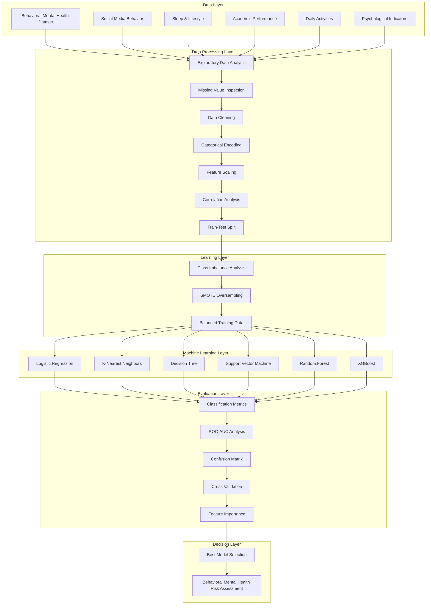

<div align="center">


</div>

---

# Behavioral Mental Health Risk Assessment using Machine Learning and Social Media Analytics

This project presents an end-to-end machine learning framework for behavioral mental health risk assessment using adolescent social media and lifestyle indicators. The pipeline integrates exploratory data analysis, feature engineering, data preprocessing, imbalance learning, comparative model development, hyperparameter optimization, explainable machine learning, and comprehensive performance evaluation to support reliable, interpretable, and data-driven mental health risk identification.

<div align="left">

[](https://www.python.org/)
[](https://scikit-learn.org/)
[](https://pandas.pydata.org/)
[](https://numpy.org/)
[](https://matplotlib.org/)
[](https://seaborn.pydata.org/)
[](https://xgboost.readthedocs.io/)
[](https://imbalanced-learn.org/)
[](#)
[](#)
[](#)
[](https://opensource.org/licenses/MIT)

</div>

---

# Abstract

Mental health disorders among adolescents have become an increasingly important public health challenge, with behavioral patterns observed through social media and lifestyle characteristics providing valuable indicators for early risk assessment. This project introduces a comprehensive machine learning pipeline for behavioral mental health risk assessment that combines exploratory data analysis, advanced preprocessing techniques, feature engineering, imbalance-aware learning, predictive modeling, and explainable artificial intelligence.

Instead of relying on a single classification algorithm, the framework systematically compares multiple machine learning models, evaluates their predictive performance using diverse classification metrics, and analyzes feature importance to improve both predictive accuracy and model transparency. The resulting workflow demonstrates how modern machine learning techniques can support interpretable and data-driven decision making for behavioral mental health assessment.

---

# Table of Contents

1. [Overview](#-overview)

2. [Machine Learning Pipeline](#-machine-learning-pipeline)

   - Dataset Exploration
   - Data Preparation
   - Feature Engineering
   - Imbalanced Learning
   - Model Development
   - Model Selection

3. [System Architecture](#system-architecture)

4. [Experimental Workflow](#experimental-workflow)

5. [Model Evaluation](#model-evaluation)

   - Classification Metrics
   - ROC Analysis
   - Feature Importance
   - Model Comparison

6. [Explainability](#explainability)

7. [Project Structure](#-project-structure)

8. [Installation](#-installation)

9. [License](#license)

10. [Author](#author)

11. [Support](#-support)

---

# 📌 Overview

Behavioral mental health assessment is a multidisciplinary problem that requires integrating behavioral indicators, demographic information, and machine learning methodologies into a unified analytical workflow. Rather than treating classification as an isolated task, this project develops a complete predictive modeling pipeline beginning with raw data exploration and ending with interpretable model evaluation.

The proposed workflow emphasizes both predictive performance and transparency. Multiple machine learning algorithms are trained and compared under identical experimental conditions, allowing objective evaluation of their strengths and limitations while highlighting the importance of feature engineering, class imbalance handling, and explainable model interpretation.

The overall framework consists of several sequential stages:

- Comprehensive Exploratory Data Analysis (EDA)
- Data Cleaning and Preparation
- Feature Engineering
- Feature Scaling and Encoding
- Class Imbalance Mitigation
- Comparative Machine Learning
- Hyperparameter Optimization
- Performance Evaluation
- Explainable Feature Analysis
- Final Behavioral Risk Assessment

---

# System Architecture

The proposed framework follows a layered machine learning architecture that systematically transforms raw behavioral observations into interpretable mental health risk predictions. Each layer is responsible for a distinct stage of the analytical workflow, ensuring modularity, reproducibility, and transparency throughout the modeling process.



### Architectural Components

| Layer | Responsibility |
|---------|----------------|
| Data Layer | Behavioral, demographic and lifestyle information collection |
| Data Processing Layer | Cleaning, preprocessing, encoding, scaling and exploratory analysis |
| Learning Layer | Class imbalance mitigation and balanced dataset generation |
| Machine Learning Layer | Comparative training of multiple supervised learning algorithms |
| Evaluation Layer | Performance comparison using multiple classification metrics |
| Decision Layer | Selection of the optimal predictive model for behavioral mental health risk assessment |

The layered architecture enables reproducible experimentation, objective model comparison, and interpretable predictive analytics while maintaining a clear separation between data preparation, model development, and evaluation.

---

# Experimental Workflow

The experimental workflow follows a reproducible machine learning lifecycle that begins with exploratory data analysis and progressively transforms raw behavioral observations into an interpretable predictive model. Each stage is designed to improve data quality, maximize predictive performance, and provide meaningful insights into adolescent mental health risk.


The workflow emphasizes reproducibility and fair model comparison by applying identical preprocessing and evaluation procedures across all candidate machine learning algorithms.

---

# Machine Learning Pipeline

The proposed pipeline is designed as a complete predictive analytics framework rather than a standalone classification model. Every processing stage contributes to improving model robustness, reducing bias, and increasing interpretability.

## Dataset Exploration

The first stage focuses on understanding the behavioral dataset through exploratory data analysis (EDA). Statistical summaries, feature distributions, class distributions, and pairwise relationships are analyzed to identify inconsistencies, potential biases, and informative behavioral patterns before model development begins.

Primary objectives include:

- Understanding feature distributions
- Identifying missing values
- Detecting outliers
- Examining class imbalance
- Investigating feature relationships
- Understanding target distribution

---

## Data Preparation

High-quality preprocessing is essential for reliable predictive modeling. Raw behavioral attributes often contain heterogeneous data types, missing observations, and categorical variables that require transformation before training machine learning models.

The preprocessing workflow includes:

- Missing value inspection
- Duplicate removal
- Data consistency verification
- Categorical feature encoding
- Numerical feature normalization
- Feature scaling
- Train-test partitioning

These preprocessing operations ensure that every model is trained under consistent and reproducible conditions.

---

## Feature Engineering

Feature engineering improves the representation of behavioral information by transforming raw observations into more informative predictive attributes.

The project investigates feature relationships and constructs an optimized feature space through statistical analysis and domain-oriented preprocessing.

Major activities include:

- Behavioral feature transformation
- Feature normalization
- Correlation analysis
- Redundant feature inspection
- Statistical feature evaluation
- Predictive feature selection

Careful feature engineering reduces noise while preserving information that contributes to mental health risk prediction.

---

## Class Imbalance Handling

Behavioral healthcare datasets frequently exhibit class imbalance, causing machine learning models to favor majority classes and reducing sensitivity toward minority samples.

To mitigate this issue, the pipeline incorporates imbalance-aware learning strategies before model training.

The adopted workflow includes:

- Minority class inspection
- Distribution analysis
- Synthetic oversampling
- Balanced training generation
- Fair model comparison

Balancing the training data significantly improves recall, F1-score, and overall robustness across multiple classifiers.

---

# Model Development

Instead of relying on a single predictive algorithm, the project evaluates multiple supervised machine learning techniques under identical experimental settings.

The comparative framework enables objective assessment of each algorithm's strengths, weaknesses, and generalization capability.

The evaluated models include:

- Logistic Regression
- K-Nearest Neighbors
- Decision Tree
- Support Vector Machine
- Random Forest
- XGBoost

Each classifier is trained using the same preprocessing pipeline and evaluated using identical performance metrics to ensure fair comparison.

---

## Hyperparameter Optimization

Model performance is further improved through systematic hyperparameter tuning.

Rather than relying on default configurations, optimized parameters are selected to maximize predictive performance while minimizing overfitting.

Optimization focuses on:

- Tree depth
- Number of estimators
- Learning rate
- Regularization parameters
- Neighbor selection
- Kernel configuration

This optimization process increases model stability and improves overall predictive performance.

---

# Model Evaluation

Reliable behavioral prediction requires more than overall accuracy. The project therefore evaluates every model using multiple complementary performance metrics.

---

## Classification Metrics

Each classifier is assessed using a comprehensive set of evaluation criteria, including:

- Accuracy
- Precision
- Recall
- F1-Score
- Specificity
- ROC-AUC

Using multiple metrics provides a more balanced understanding of predictive behavior, particularly under imbalanced class distributions.

---

## ROC Analysis

Receiver Operating Characteristic (ROC) analysis measures the discrimination capability of each classifier across different decision thresholds.

The Area Under the ROC Curve (AUC) serves as a threshold-independent indicator of model quality, enabling objective comparison between alternative machine learning algorithms.

---

## Comparative Performance Analysis

Performance comparison extends beyond individual metrics by analyzing trade-offs between predictive accuracy, sensitivity, robustness, and computational complexity.

Comparative evaluation highlights:

- Generalization capability
- Robustness against imbalance
- Prediction stability
- False positive behavior
- False negative behavior

This analysis facilitates selection of the most reliable classifier for behavioral mental health assessment.

---

## Feature Importance Analysis

Model interpretability is essential for healthcare-oriented predictive analytics.

Feature importance analysis identifies behavioral variables that contribute most significantly to prediction outcomes, improving both transparency and clinical interpretability.

Different learning algorithms provide complementary perspectives on feature relevance, allowing comparison between model-specific importance estimates and statistical feature evaluation techniques.

---

# Explainability

Predictive performance alone is insufficient for trustworthy healthcare applications. The proposed framework therefore incorporates explainability throughout the modeling process to better understand why predictions are generated.

Explainability is investigated through multiple complementary perspectives, including statistical analysis, model-based importance estimation, and comparative interpretation across different learning algorithms.

The explainability workflow focuses on:

- Statistical Feature Ranking
- Information Gain Analysis
- Fisher Score Evaluation
- Decision Tree Importance
- Random Forest Feature Importance
- XGBoost Importance Scores
- Comparative Interpretation Across Models

Rather than treating the predictive model as a black box, the framework provides interpretable evidence regarding which behavioral characteristics contribute most strongly to mental health risk assessment.

The resulting analysis improves transparency, supports reproducible experimentation, and enables more informed interpretation of machine learning predictions within behavioral healthcare applications.

---

# Experimental Results

The experimental evaluation demonstrates the effectiveness of a complete machine learning pipeline for behavioral mental health risk assessment. Rather than evaluating models solely based on predictive accuracy, the framework emphasizes robustness, interpretability, and balanced classification performance across multiple complementary evaluation metrics.

The results indicate that appropriate preprocessing, feature engineering, and imbalance-aware learning substantially improve predictive performance while maintaining model transparency.

---

## Performance Evaluation

The comparative evaluation investigates each classifier using multiple complementary metrics.

Evaluation criteria include:

- Accuracy
- Precision
- Recall
- F1-Score
- ROC-AUC
- Confusion Matrix
- Cross Validation Performance

Together, these metrics provide a comprehensive understanding of classifier behavior beyond conventional accuracy-based evaluation.

---

## Visual Results

The following visualizations summarize the most important findings obtained throughout the experimental analysis.

### Correlation Analysis

<p align="center">


</p>

The correlation heatmap illustrates relationships among behavioral variables and assists in identifying redundant information, feature dependencies, and potentially informative predictors before model training.

---

### ROC Curve Comparison

<p align="center">


</p>

Receiver Operating Characteristic (ROC) curves compare the discrimination capability of different machine learning models across multiple classification thresholds. Higher AUC values indicate stronger predictive performance and better class separability.

---

### Confusion Matrix

<p align="center">


</p>

The confusion matrix provides a detailed view of prediction outcomes, enabling analysis of correctly classified instances as well as false positives and false negatives that are particularly important in healthcare-oriented predictive tasks.

---

### Feature Importance

<p align="center">


</p>

Feature importance analysis highlights the behavioral variables that contribute most significantly to the predictive models, improving model interpretability and supporting transparent decision making.

---

# Discussion

The experimental findings demonstrate that behavioral characteristics extracted from adolescent social media and lifestyle data contain meaningful predictive information for mental health risk assessment.

Beyond predictive accuracy, the project emphasizes reproducible experimentation, balanced learning, and explainable artificial intelligence. The comparative evaluation further illustrates that no single classifier is universally optimal; instead, model selection should consider predictive performance, interpretability, robustness, and computational efficiency simultaneously.

The resulting framework provides a complete machine learning workflow suitable for educational, research, and applied predictive analytics scenarios.

---

# 📁 Project Structure

```text
Behavioral-Mental-Health-Risk-Assessment
│
├── behavioral_mental_health.ipynb
│
├── dataset/
│   └── teen_behavior_dataset.csv
│
├── figures/
│   ├── correlation_heatmap.png
│   ├── roc_curve.png
│   ├── confusion_matrix.png
│   └── feature_importance.png
│
├── requirements.txt
│
└── README.md
```

---

# 🚀 Installation

## Clone Repository

```bash
git clone https://github.com/farzadjannati/Behavioral-Mental-Health-Risk-Assessment.git

cd Behavioral-Mental-Health-Risk-Assessment
```

## Create Environment

```bash
conda create -n mental-health python=3.10

conda activate mental-health
```

## Install Dependencies

```bash
pip install -r requirements.txt
```

## Launch Jupyter Notebook

```bash
jupyter notebook
```

Open

```text
behavioral_mental_health.ipynb
```

and execute all notebook cells sequentially.

---

# Requirements

Main dependencies include:

- Python 3.10+
- NumPy
- Pandas
- Matplotlib
- Seaborn
- Scikit-Learn
- XGBoost
- Imbalanced-Learn
- Jupyter Notebook

---

# License

This project is licensed under the MIT License.

---

# Author

**Farzad Jannati**

M.Sc. Student, University of Tehran

Research Interests:

- Machine Learning
- Data Mining
- Large Language Models (LLMs)
- Retrieval-Augmented Generation (RAG)
- Agentic AI
- Information Retrieval
- Explainable Artificial Intelligence

📧 **farzadjannati@ut.ac.ir**

💻 **https://github.com/farzadjannati**

💼 **https://linkedin.com/in/farzadjannati**

---

# ⭐ Support

If you found this project useful, consider giving it a ⭐ on GitHub.

Your support helps increase the visibility of the project and encourages future open-source research and development.

---

<p align="center">

Built with ❤️ using Python, Scikit-Learn, XGBoost, Pandas, NumPy and Explainable Machine Learning

</p>
