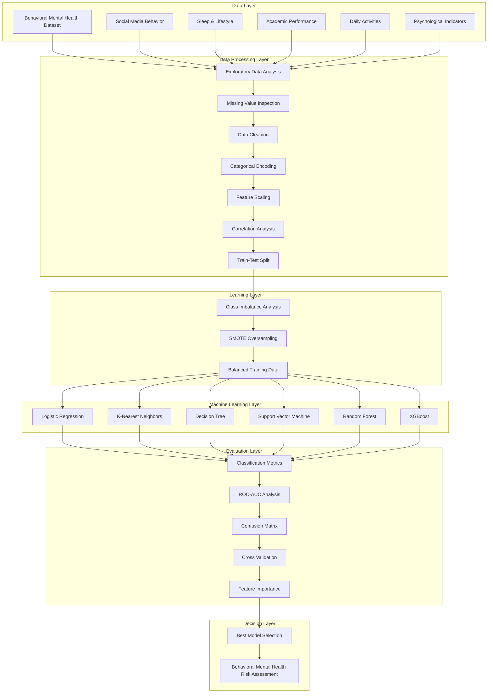

<div align="center">

</div>

---

# Behavioral Mental Health Risk Assessment using Machine Learning and Social Media Analytics

This project presents an end-to-end machine learning framework for behavioral mental health risk assessment using adolescent social media and lifestyle indicators. The pipeline integrates exploratory data analysis, feature engineering, data preprocessing, imbalance learning, comparative model development, hyperparameter optimization, explainable machine learning, and comprehensive performance evaluation to support reliable, interpretable, and data-driven mental health risk identification.

<div align="left">

[](https://www.python.org/)
[](https://scikit-learn.org/)
[](https://pandas.pydata.org/)
[](https://numpy.org/)
[](https://matplotlib.org/)
[](https://seaborn.pydata.org/)
[](https://xgboost.readthedocs.io/)
[](https://imbalanced-learn.org/)
[](#)
[](#)
[](#)
[](https://opensource.org/licenses/MIT)

</div>

---

# Abstract

Mental health disorders among adolescents have become an increasingly important public health challenge, with behavioral patterns observed through social media and lifestyle characteristics providing valuable indicators for early risk assessment. This project introduces a comprehensive machine learning pipeline for behavioral mental health risk assessment that combines exploratory data analysis, advanced preprocessing techniques, feature engineering, imbalance-aware learning, predictive modeling, and explainable artificial intelligence.

Instead of relying on a single classification algorithm, the framework systematically compares multiple machine learning models, evaluates their predictive performance using diverse classification metrics, and analyzes feature importance to improve both predictive accuracy and model transparency. The resulting workflow demonstrates how modern machine learning techniques can support interpretable and data-driven decision making for behavioral mental health assessment.

---

# Table of Contents

1. [Overview](#-overview)
2. [System Architecture](#system-architecture)
3. [Experimental Workflow](#experimental-workflow)
4. [Machine Learning Pipeline & Model Evaluation](#machine-learning-pipeline--model-evaluation)
5. [Project Structure](#-project-structure)
6. [Installation](#-installation)
7. [Author](#author)
8. [Support](#support)

---

# 📌 Overview

Mental health disorders among adolescents have become an increasingly important public health concern, motivating the development of intelligent data-driven approaches capable of identifying behavioral risk patterns at early stages. Machine learning provides an effective framework for discovering complex relationships between behavioral characteristics and mental health outcomes while supporting objective and reproducible decision making.

This project implements a complete behavioral mental health analytics pipeline rather than a standalone classification model. Beginning with raw behavioral observations, the workflow performs exploratory data analysis, data preprocessing, feature engineering, imbalance-aware learning, comparative model development, and explainable evaluation before selecting the most reliable predictive model.

The framework emphasizes three complementary objectives:

- **Predictive Performance** through comparative machine learning and hyperparameter optimization.
- **Model Robustness** through comprehensive preprocessing and imbalance-aware learning.
- **Model Interpretability** through explainable machine learning and feature importance analysis.

Unlike traditional predictive workflows that focus primarily on classification accuracy, this project adopts a comprehensive experimental methodology that prioritizes reproducibility, transparency, and systematic evaluation across multiple machine learning algorithms.

---

# System Architecture

The proposed framework follows a layered machine learning architecture that transforms raw behavioral observations into interpretable mental health risk predictions through a sequence of preprocessing, learning, evaluation, and explainability stages. Each layer is designed to ensure reproducibility, modularity, and transparency while enabling objective comparison among multiple predictive models.



The proposed architecture follows a modular machine learning workflow that separates data preparation, model development, and evaluation into independent layers. This layered design improves reproducibility, facilitates objective comparison across multiple learning algorithms, and enhances model transparency through explainable feature analysis.

---

# Experimental Workflow

The complete experimental pipeline follows a reproducible sequence of preprocessing, predictive modeling, and model interpretation, enabling systematic comparison between multiple machine learning algorithms under identical experimental conditions.


---

# Machine Learning Pipeline & Model Evaluation

The project implements a complete predictive analytics workflow that transforms raw behavioral observations into interpretable mental health risk predictions. Every stage is meticulously designed to improve data quality, model robustness, predictive performance, and explainability.

### Dataset Preparation & Feature Engineering
The raw behavioral dataset undergoes extensive preprocessing before model development. Data quality assessment, categorical encoding, feature scaling, and stratified train-test partitioning ensure that every classifier is trained under identical and reproducible experimental settings. Furthermore, feature engineering improves the predictive representation by transforming raw variables into more informative learning features. Correlation analysis and statistical feature inspection are utilized to identify redundant attributes and strengthen model performance.

### Imbalanced Learning
Behavioral healthcare datasets frequently exhibit skewed class distributions. To mitigate prediction bias toward majority classes, the training data is synthetically balanced using **SMOTETomek** before model development. This crucial step results in improved minority class recognition and more reliable clinical evaluation.

### Comparative Model Development
Instead of relying on a single predictive model, the framework performs a comprehensive comparative evaluation across multiple supervised learning algorithms. The evaluated models include:

- **Baseline Models:** Logistic Regression, K-Nearest Neighbors (KNN), Decision Tree
- **Ensemble & Advanced Models:** Support Vector Machine (SVM), Random Forest, Extreme Gradient Boosting (**XGBoost**)

Rigorous hyperparameter optimization is subsequently applied to improve predictive performance while reducing overfitting and increasing model generalization.

### Comprehensive Evaluation & Explainability
The proposed framework evaluates every classifier using multiple complementary performance metrics rather than relying solely on prediction accuracy. This provides a deep understanding of predictive behavior under imbalanced class distributions. 

The evaluation methodology focuses on:
- **Standard Metrics:** Accuracy, Precision, Recall, and F1-Score
- **Advanced Analysis:** ROC-AUC Curve Analysis and Threshold Moving for optimal clinical recall
- **Validation:** Cross-Validation and Confusion Matrix Evaluation

Beyond quantitative evaluation, the framework integrates Explainable AI (XAI) techniques. By investigating **Feature Importance** (using methods like Fisher Score and Information Gain), the pipeline uncovers how specific behavioral indicators—such as sleep hours, stress levels, and social media usage—directly contribute to mental health risk predictions, thereby maximizing overall model transparency.

---

# 📁 Project Structure

The repository is organized to ensure clarity, reproducibility, and ease of navigation across different components of the machine learning pipeline.

```text
Behavioral-Mental-Health-Risk-Assessment
│
├── behavioral_mental_health.ipynb
│
├── dataset/
│   └── teen_behavior_dataset.csv
│
├── images/
│   ├── metrics_comparison.png
│   ├── roc_curve.png
│   └── feature_importance.png
│
├── requirements.txt
│
└── README.md
```

---

# 🚀 Installation

The following steps outline how to set up and run the project locally.

## 1. Clone Repository

```bash
git clone https://github.com/farzadjannati/Behavioral-Mental-Health-Risk-Assessment.git

cd Behavioral-Mental-Health-Risk-Assessment
```

---

## 2. Create Virtual Environment

```bash
conda create -n mental-health python=3.10

conda activate mental-health
```

---

## 3. Install Dependencies

```bash
pip install -r requirements.txt
```

---

## 4. Run Notebook

Launch Jupyter Notebook:

```bash
jupyter notebook
```

Then open:

```text
behavioral_mental_health.ipynb
```

Execute all cells sequentially to reproduce the full machine learning pipeline.

---

# Author 

**Farzad Jannati**

M.Sc. Student, University of Tehran Research Assistant @ Social Networks Lab 

**Research Interests:** ML, Data Mining, Behavioral Analytics, Explainable AI (XAI) 

📧 [farzadjannati@ut.ac.ir](mailto:farzadjannati@ut.ac.ir) | 💻 [github.com/farzadjannati](https://github.com/farzadjannati) | 💼 [linkedin.com/in/farzadjannati](https://www.linkedin.com/in/farzadjannati) 

---

# Support

If you find this project useful, consider giving it a star ⭐ on GitHub.

Your support helps improve visibility of open-source research projects and encourages further development in machine learning for healthcare applications.

---

<p align="center">
Built with ❤️ using Python, Pandas, Scikit-Learn
</p>
